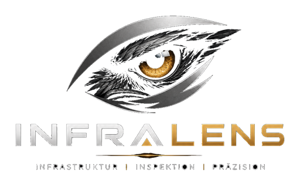

# 🛡️ InfraLens

<p align="center">
  
</p>

<p align="center">

**Professionelle Plattform für Infrastruktur- und Sicherheitsbewertungen**

*Verstehen • Bewerten • Priorisieren • Verbessern*

</p>

---

# 🚀 Überblick

InfraLens ist eine professionelle Plattform zur Analyse von IT-Infrastrukturen und Sicherheitsrisiken.

Das Ziel des Projekts ist es, technische Scan-Ergebnisse in verständliche und priorisierte Handlungsempfehlungen für Unternehmen umzuwandeln.

Im Mittelpunkt stehen dabei nicht nur offene Ports oder erkannte Geräte, sondern die Frage:

> **Welche Maßnahmen erhöhen die IT-Sicherheit eines Unternehmens am effektivsten?**

---

# ✨ Funktionen

## Infrastruktur

* ✅ Automatische Netzwerkerkennung
* ✅ Geräteinventarisierung (Asset Inventory)
* ✅ Betriebssystemerkennung
* ✅ Host-Erkennung
* ✅ Diensterkennung
* ✅ Infrastruktur-Analyse

---

## Sicherheit

* ✅ Sicherheitsbewertung
* ✅ Risikoklassifizierung
* ✅ Angriffspfad-Analyse
* ✅ Executive Action Center
* ✅ InfraLens Security Index
* ✅ Priorisierte Maßnahmenplanung

---

## Reporting

* ✅ Professionelle PDF-Berichte
* ✅ Markdown-Berichte
* ✅ Management Dashboard
* ✅ Risikodiagramme
* ✅ Executive Summary
* ✅ Maßnahmenplan

---

## Compliance

* ✅ NIS2-Bewertung
* 🚧 ISO 27001
* 🚧 CIS Controls
* 🚧 BSI-Grundschutz

---

## Kundenverwaltung

* ✅ Auftraggeberverwaltung
* ✅ Projektauswahl
* ✅ Kundennotizen

Geplant:

* Gesprächsprotokolle
* Projekthistorie
* Scan-Historie
* Wiedervorlagen

---

## Künstliche Intelligenz

* ✅ KI-Erklärungen zu Sicherheitsrisiken

Geplant:

* Auditor Assistant
* Management-Zusammenfassung
* Gesprächsleitfaden
* KI-gestützte Handlungsempfehlungen

---

# 🏗️ Architektur

```text
                    main.py
                       │
        ┌──────────────┼──────────────┐
        │              │              │
 Runtime Engine   Customer Engine   Scan Engine
                       │
                 Analysis Engine
                       │
      ┌────────────────┼────────────────┐
      │                │                │
 Security       Infrastructure     Compliance
                       │
                 Report Engine
                       │
       Markdown • PDF • NIS2 Reports
```

---

# 📁 Projektstruktur

```text
src/

├── ai/
├── automation/
├── compliance/
├── config/
├── customers/
├── engines/
├── infrastructure/
├── parsing/
├── reporting/
├── security/

docs/
tests/
```

---

# 📊 Aktueller Funktionsumfang

* Netzwerk- und Infrastruktur-Analyse
* Automatische Geräteinventarisierung
* Management Dashboard
* Executive Action Center
* Security Index
* Angriffspfad-Simulation
* NIS2-Reporting
* Priorisierte Maßnahmen

---

# 🛣️ Roadmap

## Version 1.0

* Corporate PDF Design
* Executive Action Center
* Professionelle Ergebnismappe
* Kundenverwaltung

---

## Version 1.1

* Auditor Assistant
* KI-Management-Zusammenfassung
* Gesprächsleitfaden
* Historischer Scanvergleich

---

## Version 2.0

* Grafische Benutzeroberfläche (GUI)
* Webseitenanalyse
* CVE-Integration
* Firmware-Erkennung
* Active Directory Analyse
* Compliance Dashboard

---

## Version 3.0

* Cloud-Synchronisierung
* Mehrmandantenfähigkeit
* Remote-Scans
* Ticketsystem
* Managed Security Funktionen

---

# 🎯 Vision

InfraLens soll sich von einem klassischen Netzwerkscanner zu einer vollständigen **Security Assessment Plattform** entwickeln.

Der Schwerpunkt liegt darauf, IT-Sicherheit verständlich darzustellen, Risiken zu priorisieren und Unternehmen bei fundierten Sicherheitsentscheidungen zu unterstützen.

Nicht technische Details stehen im Mittelpunkt, sondern deren Bedeutung für den Geschäftsbetrieb.

---

# ⚙️ Installation

```bash
git clone https://github.com/<svenschult>/infralens.git

cd InfraLens

pip install -r requirements.txt

python src/main.py
```

---

# 📄 Lizenz

Dieses Projekt steht unter der MIT-Lizenz.

---

# 👨‍💻 Entwickler

**Sven Schult**

InfraLens wird mit dem Ziel entwickelt, professionelle Sicherheitsbewertungen für kleine und mittlere Unternehmen bereitzustellen und komplexe technische Informationen verständlich aufzubereiten.

---

# ⭐ Unterstützung

Wenn dir InfraLens gefällt, freue ich mich über einen ⭐ auf GitHub.

Das unterstützt die Weiterentwicklung des Projekts und erhöht seine Sichtbarkeit.
